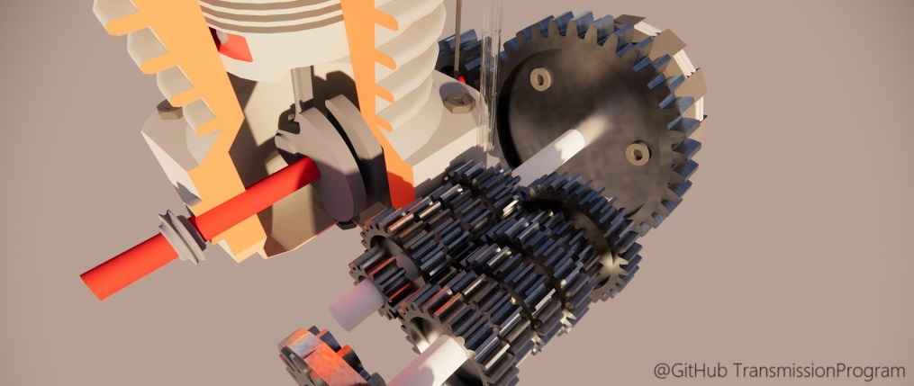

# TransmissionProgram
Shared space for online program "the origin and design of motorcycle transmission system"

- 本仓库包含制作变速箱设计节目的关键数据源文件、模型源文件、以及配图源文件。
- 视频资源、更细致更多的摩托车节目制作模型资源，将后续逐步补充添加。这些文件体积过大，需要想一些易于访问下载的共享途径。
    - 全部视频资源已分享至： 【摩托发动机变速箱高清素材开放共享-摩托机械类完整节目合集资源 -《全网最强变速底层设计原理》制作资源】 https://www.bilibili.com/video/BV1EC411p7ko/?share_source=copy_web&vd_source=0c7f0e1830659135ade885f5795719e3
- 相当一部分资源来自于网络公开搜集，如有涉及侵犯您的权益，请及时告知，将配合尽快删除。

- This repo contains useful materials for introduction of transmission system.
- Considering the significant file size of some video clips, all videos were uploaded to https://www.bilibili.com/video/BV1EC411p7ko/?share_source=copy_web&vd_source=0c7f0e1830659135ade885f5795719e3 openly available for viewing without any login requirement.
- if recources contained in this repo voilates your right, please contact me for timely deletion. 